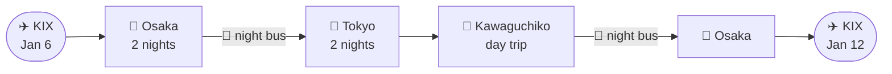

# 🗻 Japan Winter Trip 2027

**Osaka ⇄ Tokyo ⇄ Mt Fuji · 6 friends · 6 nights / 7 days · halal-friendly**

---

## 📍 The trip at a glance

| | |
|---|---|
| **Land** | Jan 6, 09:15 — Kansai International (KIX) |
| **Leave** | Jan 12, 07:40 |
| **Route** | Osaka (2 nights, guesthouse) → 🚌 overnight bus → Tokyo (2 nights, manga cafe) → Kawaguchiko day trip for Mt Fuji → 🚌 overnight bus back to Osaka |
| **Budget** | ≈₩872,000 per person all-in (flights, stay, transport, food, buffer) · ≈₩5.23M for all 6 |
| **Food & prayer** | Halal food spots and solat times are built into every day of the schedule |

## ✅ Booking checklist

- [x] Flights (all 6)
- [x] Osaka guesthouse
- [ ] Overnight bus Osaka → Tokyo (Willer Express)
- [ ] Bus Kawaguchiko → Osaka (Fujiyama Liner)
- [ ] Manga cafe booths in Tokyo (reserve a few days ahead)
- [ ] ICOCA / Suica card for city metro

> [!IMPORTANT]
> The overnight buses sell out around the New Year period. See **§09 "Book these now"** in the dossier for why they're time-sensitive.

## 📂 What's in this repo

| File | What it is |
|---|---|
| [`index.html`](./index.html) | The full trip dossier: flights, budget breakdown, day-by-day route, halal food guide, and what to book early. It's published as the [live site](https://irfnaimann02.github.io/japan-winter-trip-2027/), so read it there rather than as raw code on GitHub. |
| [`Japan_Winter_Trip_Itinerary.xlsx`](./Japan_Winter_Trip_Itinerary.xlsx) | Minute-by-minute schedule from landing at KIX to departure, covering every meal, every solat time, and a per-person and per-group cost breakdown with formulas. Open in Excel, Google Sheets or Numbers. |

## 🗂️ Inside the dossier

1. Is Osaka even the right call?
2. Booked ✓ (Jan 6–12, 2027)
3. Getting there (flights)
4. Where to sleep
5. What it costs per person
6. Kereta sewa: do you actually need one?
7. The route: Osaka ⇄ Tokyo ⇄ Mt Fuji
8. Halal food, solat & masak sendiri
9. Book these now, before seats run out
10. Ways to trim it further

## 🔒 Privacy note

This repo is **public**. Booking confirmation codes, passport details and phone numbers are deliberately left out. If you need one, ask in the group chat.

---

Prices are planning estimates for winter 2026–27. Re-check exact numbers before booking.

